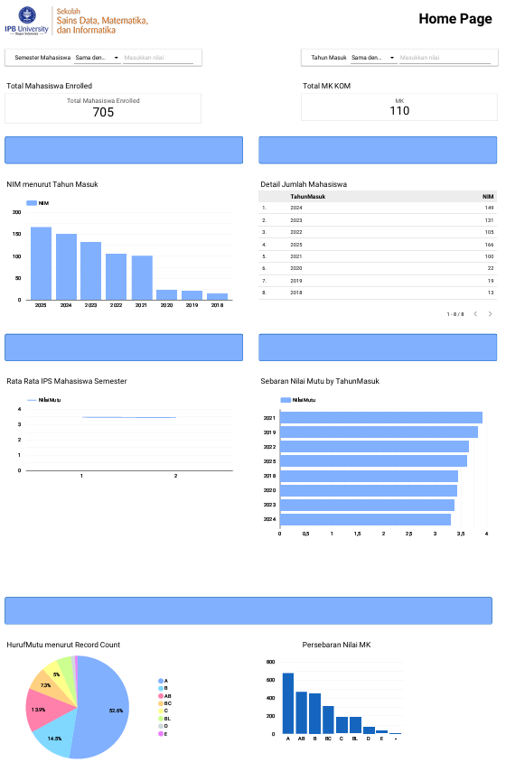
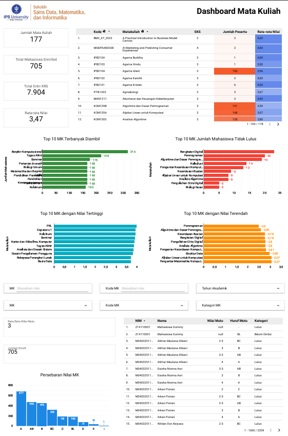
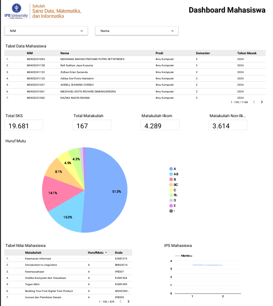

# Dashboard Akademik Mahasiswa S1 Ilmu Komputer IPB

> **Proyek Capstone KOM1402 (Kelompok Caps02)**
>
> Repositori ini berisi dokumentasi, skema dataset, dan rumus kalkulasi untuk **Dashboard Akademik Mahasiswa S1 Ilmu Komputer** yang dibangun menggunakan **Data Studio**.

---

## 🔗 Link Dashboard & Demo

* **Format Ekspor PDF**: [Dashboard_KOM_S1.pdf](results/Dashboard_KOM_S1.pdf)
* **Contoh Data Masukan**: [sample_krs_merged.csv](data/sample_krs_merged.csv)

---

## 📌 Deskripsi Proyek

Dashboard ini dirancang untuk menyajikan visualisasi data akademik mahasiswa S1 Ilmu Komputer IPB secara interaktif. Dengan dashboard ini, program studi, dosen pembimbing, ataupun tata usaha dapat melacak tren pendaftaran mahasiswa, kinerja mata kuliah, tingkat kelulusan kelas, serta kemajuan akademik individu mahasiswa.

* **Platform BI**: Looker Studio (Google Data Studio)
* **Sumber Data**: Data Akademik Mahasiswa S1 & Entri KRS Terintegrasi

---

## 📸 Dokumentasi Visual (Previews)

### Halaman 1: Sebaran Mahasiswa (Home Page)



### Halaman 2: Dashboard Mata Kuliah



### Halaman 3: Dashboard Mahasiswa (Profil Individu)



---

## 📂 Struktur Repositori

Meskipun Looker Studio merupakan perangkat BI *no-code*, repositori ini mendokumentasikan seluruh data dan logika di balik layar agar dashboard ini dapat dibuat dengan baik:

```text
KOM1402-capstone--caps02/
├── README.md                  
├── results/
│   ├── Dashboard_KOM_S1.pdf     # Hasil ekspor dashboard dalam format PDF
│   └── screenshots/             # Screenshots visualisasi dashboard untuk dokumentasi README
│       ├── Homapage.png
│       ├── MataKuliah.png
│       └── Mahasiswa.png
├── docs/
│   ├── data_dictionary.md       # Kamus data, tipe data, dan skema kolom
│   └── calculated_fields.md     # Log detail formula yang digunakan di Looker Studio
├── data/
│   └── sample_krs_merged.csv    # Sampel data tiruan sebanyak 30 baris dari KRS_Merged
└── .gitignore          
```

---

## 👥 Anggota Kelompok (Caps02)

* **Nisa Amelia** - NIM: `G6401231022`
* **M Althaf Faiz Rafianto** - NIM: `G6401231061`
* **Muhammad Agung Rizkiansyah** - NIM: `G6401231096`
* **Kasyifa Naila Alisha** - NIM: `G6401231139`

---

## 🛠️ Langkah Pengerjaan Proyek oleh Kelompok

Kelompok kami menyelesaikan pengerjaan dashboard ini melalui tahapan terstruktur berikut:

### Langkah 1: Persiapan & Integrasi Data

Kami mengintegrasikan seluruh data akademik mahasiswa dan transaksi KRS ke dalam satu dataset terpadu (`KRS_Merged.xlsx`) lalu mengunggahnya ke Google Sheets agar terkoneksi secara langsung dengan Looker Studio. Format dan tipe data tiap kolom dirancang sesuai dengan panduan pada [Kamus Data (Data Dictionary)](docs/data_dictionary.md).

### Langkah 2: Menghubungkan Data Source

Kami menghubungkan Google Sheets tersebut ke dalam Looker Studio sebagai sumber data utama. Karena data sudah digabungkan sejak awal, kami tidak memerlukan proses *data blending* yang rumit di sisi Looker Studio sehingga performa laporan menjadi lebih optimal.

### Langkah 3: Pembuatan Kolom Kalkulasi (Calculated Fields)

Untuk menghasilkan analisis yang lebih mendalam, kami menambahkan 4 kolom kalkulasi dinamis di tingkat data source menggunakan rumus yang didokumentasikan pada [Formula Calculated Fields](docs/calculated_fields.md):

* **`is_mayor`**: Memisahkan mata kuliah wajib departemen (`Mayor`) dan pilihan/pendukung (`EC/SC`).
* **`nilaimutu`**: Melakukan konversi otomatis nilai huruf mutu mahasiswa ke skala IP numerik (0.0 - 4.0).
* **`is_lulus`**: Melacak status kelulusan kelas (Lulus, Tidak Lulus, atau Belum Dinilai) untuk mempermudah analisis kelas bermasalah.
* **`TipeMK`**: Mengklasifikasikan asal kurikulum mata kuliah (Program Studi, IPB (Umum), MOOC, Exchange, atau Lintas Prodi).

### Langkah 4: Perancangan Tata Letak Visual (Layout)

Kami merancang tata letak visual dashboard secara interaktif yang terbagi menjadi 3 halaman utama (Sebaran Mahasiswa, Dashboard Mata Kuliah, dan Dashboard Mahasiswa). Hasil visualisasi akhir dan tata letak komponen dirancang seperti berkas ekspor statis [Dashboard_KOM_S1.pdf](results/Dashboard_KOM_S1.pdf).